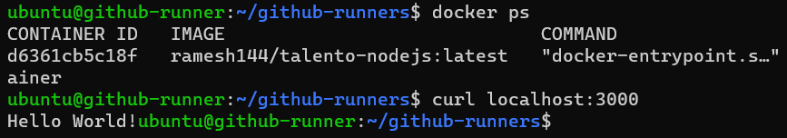

# GitHub Actions CI/CD Pipeline for Node.js Web App

This document outlines the steps to create a GitHub Actions workflow for Continuous Integration (CI) and Continuous Deployment (CD) of a Node.js web app. The workflow will include containerizing the application, publishing it to Docker Hub, and deploying it locally.

## Containerize the Application

### Build the Docker image

The Dockerfile location is [Dockerfile](Dockerfile)

Pushed to Dockerhub as [talento-nodejs](https://hub.docker.com/r/ramesh144/talento-nodejs) with both latest tag and commit ID.

## CI Pipeline

###  GitHub Actions Workflow for CI

CI Pipeline YML file is [.github/workflows/ci.yml](./.github/workflows/ci.yml)
Successful run for the pipeline is https://github.com/rameshnamani/talento-exercise-1/actions/runs/6119400844

## CD Pipeline

### GitHub Actions Workflow for CD

CI Pipeline YML file is [.github/workflows/cd.yml](./.github/workflows/cd.yml)

Successful run for the pipeline is https://github.com/rameshnamani/talento-exercise-1/actions/runs/6119400840

## CI/CD Pipeline for main branch

CI/CD Pipeline YML file is [.github/workflows/ci-cd.yml](./.github/workflows/ci-cd.yml)

Successful run for the pipeline is https://github.com/rameshnamani/talento-exercise-1/actions/runs/6119488834

## Testing

After setting up the CI/CD pipeline, test it by pushing changes to the main branch of the repository. The pipeline will automatically build and deploy the Node.js web app in the [self-hosted Gitlab Runner](https://github.com/rameshnamani/talento-exercise-1/settings/actions/runners/2). Access the running container by sending an HTTP request to `http://localhost:3000` and expect to receive "Hello World!" as a response in the runner.

